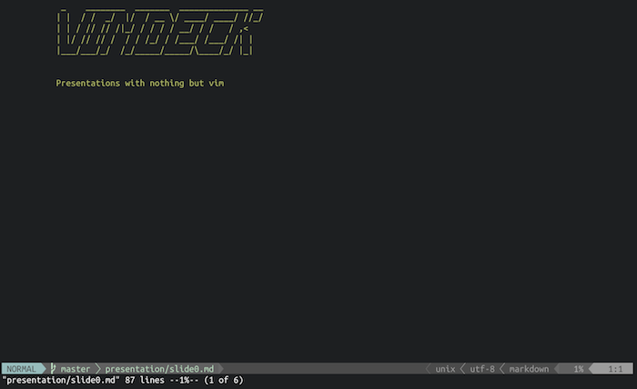
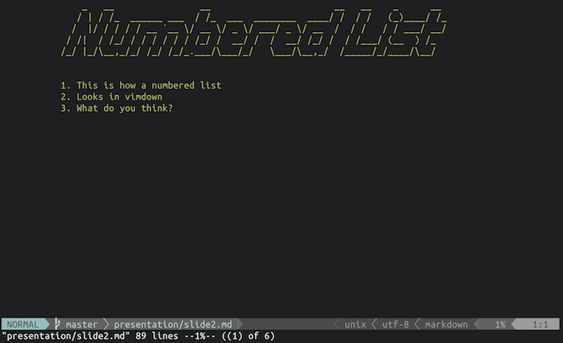
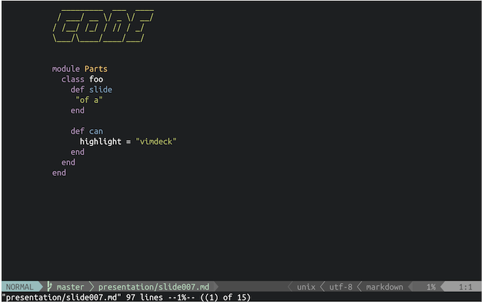
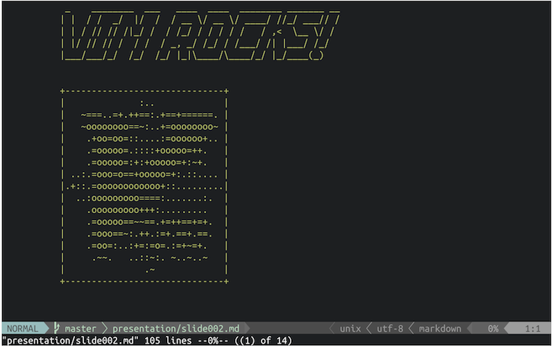

# Vimdeck [](http://badge.fury.io/rb/vimdeck)

VIM as a presentation tool


## News

Vimdeck now uses [redcarpet](http://github.com/vmg/redcarpet) to parse and render markdown!

I've cleaned up the code significantly. So those of you who like more features in Vimdeck
can fork and pull-request your buns off.


## Installation

Install a markdown syntax highlighting plugin for VIM. (I recommend [tpope/vim-markdown](http://github.com/tpope/vim-markdown))

Install the VIM plugin [SyntaxRange](https://github.com/vim-scripts/SyntaxRange).

```
gem install vimdeck
```

If you have problems getting RMagick to install, try installing [ImageMagick](http://www.imagemagick.org/) explicitly first. You may also need [MagickWand](http://www.imagemagick.org/script/magick-wand.php) and Ruby Development tools (libmagickwand-dev and ruby-dev respectively on Ubuntu).

**Note:** if you're on Mac OS Sierra, you may need to run the following command to get RMagick/vimdeck to install:

```
brew install imagemagick@6
brew link imagemagick@6 --force
gem install vimdeck
```

Also, if you're getting errors about a missing pkg-config, doublecheck that you have pkg-config installed:

```
brew install pkg-config
```


## Usage

1. Write your slides in a markdown file (See below for details on _limited_ markdown syntax)

2. Run `vimdeck <file_name.md>` and it will generate a file for each slide and open them in VIM


## VIM Script

Vimdeck will also provide a script file that will set up keybindings for you.

- PageUp/Left go backwards
- PageDown/Right go forward
- Q closes presentation


## A Note about VIM

This is a tool meant for VIM users. In other words, it is not a VIM plugin
&mdash; it's a script that converts a plain text document into multiple files.

The only hard dependency is [SyntaxRange](https://github.com/vim-scripts/SyntaxRange).

Other than that you may need some syntax highlighting plugins to handle the code syntax highlighting. [vim-scripts/ingo-library](https://github.com/vim-scripts/ingo-library) may be required for syntax highlighting.


## A Note About Markdown

Slides are separated by 2 newlines in a row.

Example:

```
# Slide 1

- has some
- really important
- information


# Slide 2

Is less important
```

Vimdeck uses redcarpet to parse its markdown and implements a custom renderer
for things like ascii art. It uses a very small subset of markdown. List of items supported:

- h1s
- h2s
- images
- fenced code blocks

That's it. The point of Markdown is that it's human-readable. Other stuff like (un)ordered
lists, block quotes, indented code blocks, etc. will be displayed just as they were written.

Fenced code blocks look like this:

    ```javascript
       this.is = 'code'
    ```

## Highlighting Syntax

Vimdeck also supports "highlighting" parts of a slide. This is an experimental feature and needs more testing.

Use `{~ unimportant_text_here ~}` to "unhighlight" portions of a slide:

    # Slide Title

    {~- Unimportant bullet~}
    - Important bullet
    {~- Really unimportant bullet~}

This allows you to create multiple versions of the same slide but with different parts highlighted.
Which is something I like to use often when presenting code snippets.

## Why Ruby?

Additionally, I want to point out that I realize that it's odd to have a VIM-based tool
and not write it as a VIM script. Ruby was my language of choice only because the ascii art dependencies
were implemented as ruby gems. Plus, I &hearts; ruby.


## Screenshots:


Vimdeck converts h1s and h2s into ascii art



Lists are displayed as they are written



Vimdeck will also augment its vimscript to provide syntax highlighting



Images are even converted to ascii art!



---------------------

Made by [tybenz](http://github.com/tybenz): [tybenz.com](http://tybenz.com) // [@tybenz](http://twitter.com/tybenz)


[](https://bitdeli.com/free "Bitdeli Badge")

